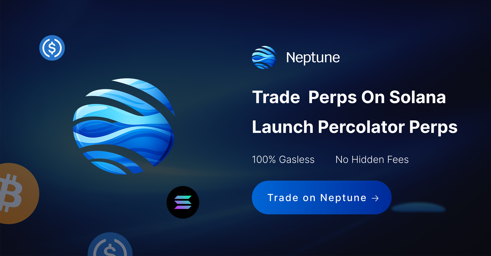

# Neptune

**Gasless permissionless perps on Solana.**  
Trade with **$0 network fees on supported flows**, launch **Percolator markets with zero deploy cost on devnet**, and verify execution with **Proof Pages**.



[](https://opensource.org/licenses/MIT)
[](https://github.com/NeptunePerps)
[](https://github.com/aeyakovenko)
[](https://solana.com)
[](https://www.rust-lang.org)
[](https://neptune-perps.trade)
[](https://x.com/NeptunePerps)
[](https://neptune-perps.trade)
[](https://nextjs.org)
[](https://www.typescriptlang.org)

> **Neptune is the trading terminal and launch layer for Percolator-style perpetuals.**  
> It turns protocol primitives into a usable product surface: **gasless trading, zero-cost devnet market launch, proof-first verification, PropAMM, and Micro Order Books.**

---

## Table of Contents

- [What Neptune is](#what-neptune-is)
- [Why Neptune exists](#why-neptune-exists)
- [Built on Percolator](#built-on-percolator)
- [What Neptune does](#what-neptune-does)
- [Core ideas](#core-ideas)
- [Proof Pages](#proof-pages)
- [Proof-native by design](#proof-native-by-design)
- [Liveness and oracle truth](#liveness-and-oracle-truth)
- [Who Neptune is for](#who-neptune-is-for)
- [Quick start](#quick-start)
- [Project structure](#project-structure)
- [Security notes](#security-notes)
- [Roadmap](#roadmap)
- [Contributing](#contributing)
- [Philosophy](#philosophy)
- [Links](#links)
- [License](#license)

---

## What Neptune is

Neptune is a product for **permissionless perpetuals on Solana**.

It does two things well:

1. **Trading terminal** — trade perps with a gasless UX on supported flows.
2. **Launch layer** — create and inspect Percolator markets on devnet without deployment cost.

That means:

- traders can open and manage positions without carrying extra network-fee friction
- builders can launch markets without going through a full deployment ritual
- everyone can inspect what actually happened onchain

Neptune is built around a simple principle:

> **If a market is real, the proof should be easy to find.**

---

## Why Neptune exists

Perps on Solana should be:

- **permissionless to launch**
- **cheap to use**
- **non-custodial**
- **easy to verify**
- **honest about oracle state**
- **honest about liveness**
- **built for scrutiny, not just screenshots**

That is the gap Neptune is trying to close.

Too many trading products stop at the interface.  
Neptune goes one layer deeper:

- how the market launches
- how execution works
- what oracle path is active
- whether the market is fresh
- what was actually invoked
- what proof trail remains after the action

Neptune is not just “where you trade.”  
It is the surface where **launch, execution, and verification** come together.

---

## Built on Percolator

Neptune is built around the open-source **Percolator** design and upstream repositories initiated by [Anatoly Yakovenko](https://x.com/toly).

Public upstream lineage:

- [aeyakovenko/percolator](https://github.com/aeyakovenko/percolator)
- [aeyakovenko/percolator-prog](https://github.com/aeyakovenko/percolator-prog)
- [aeyakovenko/percolator-match](https://github.com/aeyakovenko/percolator-match)
- [aeyakovenko/percolator-cli](https://github.com/aeyakovenko/percolator-cli)

Percolator gives Neptune the core protocol shape:

- margin and liquidation logic
- vault and insurance accounting
- oracle-driven market state
- crank / liveness assumptions
- matcher-based execution
- explicit onchain constraints

Neptune builds the product surface around those primitives:

- trading terminal
- launch flow
- receipts
- Proof Pages
- oracle visibility
- liveness visibility
- execution inspection
- builder UX for real usage

> **Percolator is the engine. Neptune is the surface.**

Neptune is an independent product built around the Percolator design.  
It is **not** an official Solana or Percolator project unless explicitly stated otherwise.

---

## What Neptune does

Neptune combines two core product surfaces into one platform.

### 1) Gasless mainnet perps

A trading terminal for Solana perpetuals with **$0 network fees on the user side for supported flows**.

Main features:

- gasless trading UX
- wallet-native signing
- long / short positions
- market and limit flows where supported
- position management
- transaction receipts
- Proof Pages for inspection

> Gasless refers to supported network-fee abstraction on the user side.  
> Protocol fees, spreads, funding, and other venue-level costs may still apply.

### 2) Zero-cost devnet launch

A launch flow for creating **Percolator-style perpetual markets** on devnet.

Main features:

- zero deploy cost on devnet
- permissionless market creation
- guided market configuration
- oracle routing setup
- matcher / execution selection
- Proof Pages immediately after launch
- exportable market configuration
- live rent / cost computation from RPC where supported
- atomic core deploy where supported to avoid partial, stranded setup state

### 3) Devnet market discovery and inspection

A proof-oriented devnet surface for builders and researchers.

Main features:

- markets directory sourced from onchain state where supported
- no dependence on hardcoded market lists when registry / index data is available
- builder-friendly inspection flow for market truth, oracle truth, and liveness truth
- receipts and explorer-linked state transitions

---

## Core ideas

### Gasless trading

Trading should not feel heavier than it needs to.

On supported flows, Neptune removes Solana network-fee friction from the user side so the interaction is closer to:

1. connect wallet
2. sign
3. trade
4. inspect the result

That is a better product loop than asking users to manage network fees for every action.

### Permissionless market launch

If a perp market can exist, launching it should not require ceremony.

On devnet, Neptune makes it possible to create a Percolator market with **zero deploy cost**, inspect the configuration, and run the product without deployment overhead.

### PropAMM

Neptune uses a **PropAMM-oriented execution direction** for thin-market conditions.

Why that matters:

- thin markets need guarded price formation
- inventory and utilization matter
- volatility should affect spreads
- oracle divergence should be visible and handled
- profit extraction should not outrun system reality

Neptune treats pricing as part of the product truth surface, not just the matching layer.

### Micro Order Books

Micro Order Books are Neptune’s next execution surface.

They exist because a single continuous liquidity model is not always enough for thin markets.

The design direction includes:

- sovereign maker books
- parametric quoting
- pro-rata execution
- cheaper quote updates
- less dependence on pure queue priority
- more explicit maker expression

Neptune does not view Micro Order Books as a cosmetic add-on.  
They are part of the broader search for better thin-market price formation on top of the Percolator safety model.

---

## Proof Pages

Proof Pages are one of Neptune’s defining surfaces.

They exist to answer the real questions:

- What market is this?
- What programs are involved?
- Is the program upgradeable?
- Who controls upgrades?
- What oracle path is active?
- Is the market stale?
- When was the last crank?
- What happened in this transaction?
- Can I export the evidence?

### Proof surfaces can include

- **Addresses Truth Table** — key market accounts, PDAs, vaults, insurance, and related addresses
- **Program Truth Panel** — upgradeability, upgrade authority, explorer links
- **Oracle Health** — source, mode, health, staleness, confidence, fallback state where supported
- **Liveness / Crank Panel** — fresh vs stale state, last crank slot / time, action gating where relevant
- **Market State Panel** — vault balances, insurance context, fees, open interest, funding, and risk parameters where supported
- tx signatures
- invoked programs
- CPI traces
- exportable receipt JSON

A lot of crypto products say “trustless.”  
Neptune prefers a stronger standard:

> **Inspectable by default.**

---

## Proof-native by design

Neptune does not treat proof as an afterthought.

That means:

- important actions produce receipts
- oracle state is visible
- liveness is visible
- program truth is visible
- proof can be exported
- unavailable data should be shown as unavailable, not invented

### Zero mock data

If data cannot be read from RPC or onchain state, Neptune should show it as **unavailable** — not guessed, prettified, or fabricated.

A Neptune receipt may include:

- transaction signature
- action type
- market identifier
- invoked programs
- inner CPI traces
- oracle status
- program truth
- crank freshness
- exportable JSON

Field names may evolve.  
The principle does not:

> **Every critical action should leave behind portable, inspectable evidence.**

---

## Liveness and oracle truth

Percolator-style markets depend on fresh state. Neptune does not hide that.

Neptune surfaces:

- fresh vs stale state
- last crank slot / time
- gating where freshness matters
- oracle route selection
- oracle health
- confidence and staleness where supported
- fallback readiness where supported

This is part of the product, not buried implementation detail.

Because serious users want to know:

- is the market fresh?
- which oracle path is active?
- is this state safe enough for the action I’m taking?

---

## Who Neptune is for

### Traders

For users who want:

- lighter perp UX
- gasless execution on supported flows
- wallet-native interaction
- receipts and proof after execution

### Builders

For users who want:

- to launch Percolator-style markets
- inspect program truth
- inspect oracle truth
- inspect liveness
- build on auditable primitives

### Researchers and skeptics

For people who care about:

- protocol lineage
- open-source credibility
- onchain verification
- evidence over narrative

---

## Quick start

### Prerequisites

- Node.js **18+**  
  Recommended: **20+**
- `pnpm` recommended
- A Solana wallet such as **Phantom** or **Solflare**
- Devnet SOL for local testing where required

### Install

```bash
git clone https://github.com/NeptunePerps/neptune.git
cd neptune
pnpm install

Environment
Create a local env file:
cp .env.example .env.local
Example variables:
NEXT_PUBLIC_MAINNET_RPC_URL=https://mainnet.helius-rpc.com/?api-key=YOUR_KEY
NEXT_PUBLIC_DEVNET_RPC_URL=https://devnet.helius-rpc.com/?api-key=YOUR_KEY
Use the exact variable names expected by the repo.
Run locally
pnpm dev
Open:
http://localhost:3000
Production build
pnpm build
pnpm start
 
Project structure
app/
  page.tsx
  app/
    mainnet/
    devnet/
      launch/
      markets/[marketId]/
components/
lib/
public/
src/
Structure may evolve as Neptune expands.
 ```

Security notes
•	Neptune does not hold private keys
Users sign with their own wallet. 
•	Keep secrets in .env.local
Never commit RPC credentials or private configuration. 
•	Receipts are exportable
Useful for audit, debugging, and verification. 
•	Program truth matters
Upgradeability and authority are surfaced where supported. 
•	Experimental software warning
Treat the repo as experimental unless explicitly stated otherwise. 
•	Upstream warning
Percolator and related upstream repositories describe themselves as educational / experimental software and not audited for production use. 
 
Roadmap
Neptune is moving toward a default product surface for permissionless perpetuals on Solana.
Shipped
•	gasless mainnet trading flows 
•	zero-cost devnet market launch 
•	PropAMM + thin-market guardrails 
•	multi-oracle routing 
•	proof-oriented action and market surfaces 
In progress
•	Micro Order Books v0.1 
•	deeper pricing truth surfaces 
•	stronger market interoperability 
•	improved discovery across permissionless perp markets 
Direction
•	better thin-market price formation 
•	better maker expression 
•	better proof surfaces 
•	better launch ergonomics 
•	better end-to-end verification 
 
Contributing
Contributions are welcome.
High-leverage areas include:
•	Proof Pages 
•	receipts 
•	oracle visibility 
•	liveness UX 
•	pricing verification 
•	launch flow reliability 
•	Percolator interoperability 
•	developer ergonomics 
•	execution transparency 
If you open a PR, please include:
•	a clear description 
•	screenshots for UI changes 
•	notes on state transitions where relevant 
•	verification details if you touched proof or execution surfaces 
 
Philosophy
Neptune is built around a simple belief:
The best perpetuals platform is not just the one with the best execution.
It is the one with the best execution and the best truth surface.
That is why Neptune emphasizes:
•	Percolator 
•	permissionless launch 
•	gasless usage 
•	visible execution logic 
•	proof 
•	receipts 
•	inspectability 
We want perpetuals on Solana to feel:
•	open 
•	composable 
•	inspectable 
•	credible 
•	real 
 
## Links
- **Website:** [neptune-perps.trade](https://neptune-perps.trade)
- **X:** [@NeptunePerps](https://x.com/NeptunePerps)
- **GitHub:** [NeptunePerps](https://github.com/NeptunePerps)
- **Percolator:** [aeyakovenko/percolator](https://github.com/aeyakovenko/percolator)
- **Percolator Prog:** [aeyakovenko/percolator-prog](https://github.com/aeyakovenko/percolator-prog)
- **Percolator Match:** [aeyakovenko/percolator-match](https://github.com/aeyakovenko/percolator-match)
- **Percolator CLI:** [aeyakovenko/percolator-cli](https://github.com/aeyakovenko/percolator-cli)
## License
**MIT** for this repository. Integrated protocols and vendor code retain their own licenses.
---

Upstream repositories, integrated protocols, and third-party dependencies retain their own licenses and terms
